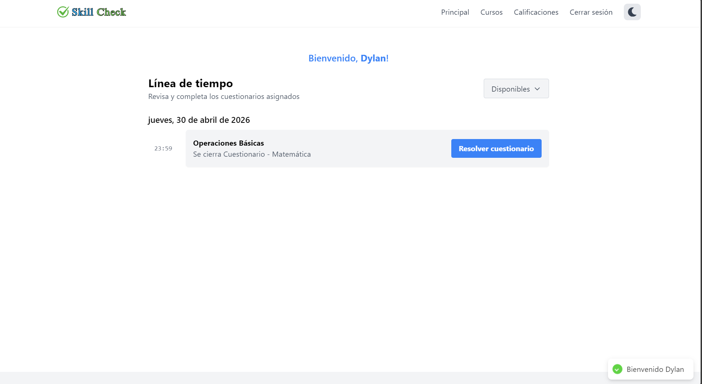
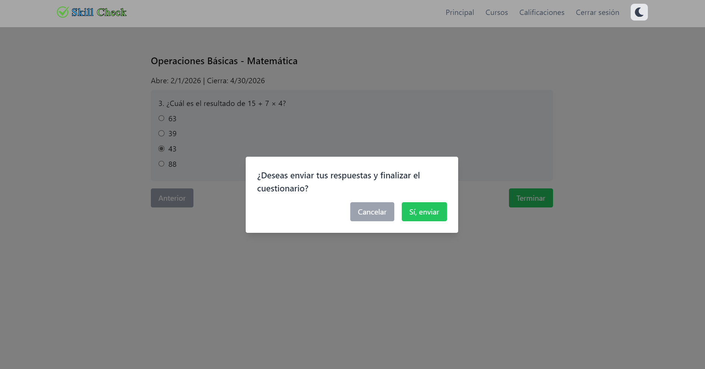
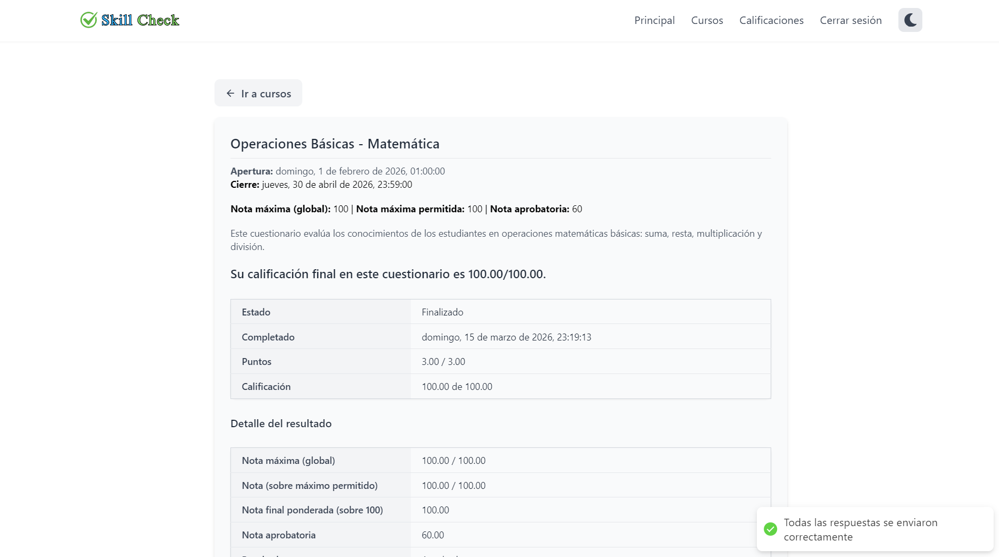
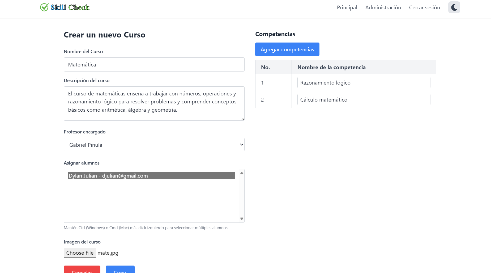
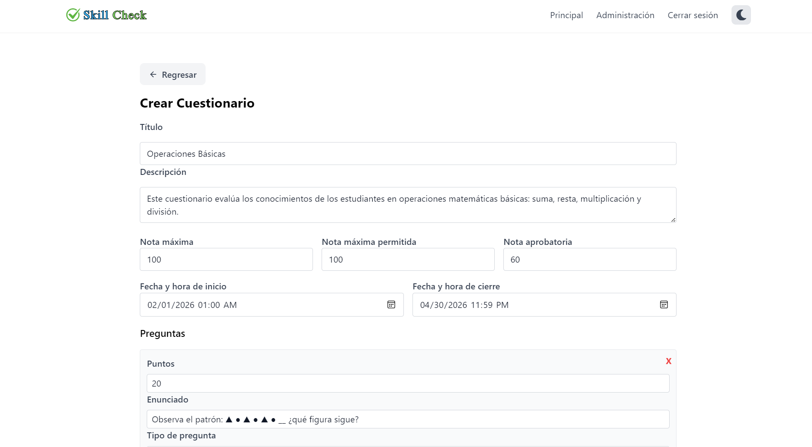
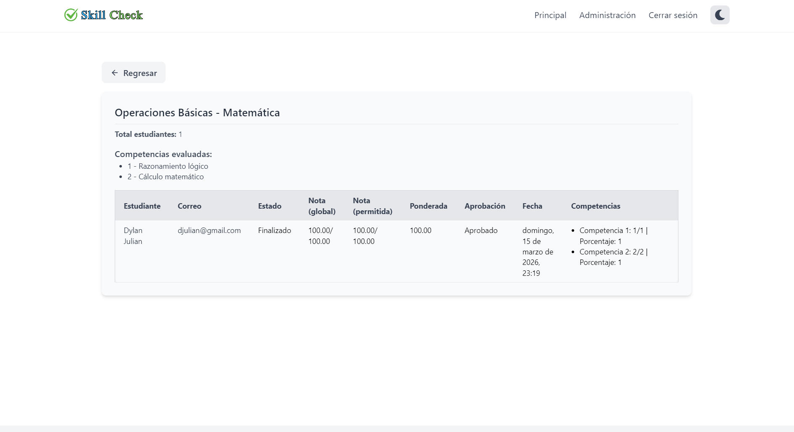

# SkillCheck Frontend

Aplicación web frontend para la evaluación de competencias mediante cuestionarios interactivos.

[](https://opensource.org/licenses/MIT)
[](https://reactjs.org/)
[](https://vitejs.dev/)

## Tabla de Contenidos

- [Descripción](#descripción)
- [Vista de la aplicación](#vista-de-la-aplicación)
- [Características Principales](#características-principales)
- [Tecnologías Utilizadas](#tecnologías-utilizadas)
- [Requisitos Previos](#requisitos-previos)
- [Instalación](#instalación)
- [Configuración de Variables de Entorno](#configuración-de-variables-de-entorno)
- [Uso de la Aplicación](#uso-de-la-aplicación)
- [Estructura del Proyecto](#estructura-del-proyecto)
- [Componentes Principales](#componentes-principales)
- [Licencia](#licencia)
- [Autores](#autores)

## Descripción

SkillCheck Frontend es una aplicación web moderna desarrollada en React que proporciona una interfaz intuitiva para la plataforma de evaluación de competencias. La aplicación permite a los estudiantes realizar cuestionarios, visualizar sus resultados y analizar su desempeño por competencias, mientras que los administradores pueden gestionar usuarios, cursos y evaluaciones.

La interfaz está diseñada con una experiencia de usuario optimizada, incluyendo modo oscuro y una navegación fluida que facilita el acceso a todas las funcionalidades de la plataforma.

## Vista de la aplicación



### Student Panel



### Admin Panel




> **Nota:** Puede visualizar todas las imágenes de la aplicación en [Screenshots](docs/screenshots.md).

## Características Principales

- **Interfaz Moderna**: Diseño responsive y atractivo con Tailwind CSS
- **Modo Oscuro**: Soporte completo para tema claro y oscuro
- **Navegación Intuitiva**: Sistema de rutas bien estructurado con React Router
- **Gestión de Estado**: Context API para manejo de estado global
- **Notificaciones en Tiempo Real**: Sistema de notificaciones con react-hot-toast
- **Formularios Optimizados**: Validación y manejo de formularios con react-hook-form
- **Autenticación Segura**: Integración con JWT del backend
- **Dashboard de calificaciones**: Visualización de resultados

## Tecnologías Utilizadas

### Frontend Core
- **React 19** - Biblioteca principal para la interfaz de usuario
- **Vite 7** - Herramienta de construcción y desarrollo
- **React Router DOM** - Gestión de rutas y navegación
- **Tailwind CSS** - Framework de CSS para estilos

### Estado y Datos
- **Context API** - Manejo de estado global
- **Axios** - Cliente HTTP para comunicación con la API
- **React Hook Form** - Manejo de formularios y validación

### UI/UX
- **React Icons** - Biblioteca de iconos
- **React Modal** - Componentes modales
- **React Hot Toast** - Sistema de notificaciones
- **Dark Mode Context** - Gestión de tema claro/oscuro

### Desarrollo
- **ESLint** - Linting y calidad de código
- **PostCSS** - Procesamiento de CSS
- **Autoprefixer** - Compatibilidad de CSS

## Requisitos Previos

- Node.js >= 18.0.0
- npm >= 8.0.0
- Git
- Navegador web

## Instalación

Sigue estos pasos para configurar el proyecto en tu entorno local:

### 1. Clonar el repositorio
```bash
git clone https://github.com/gpinula-2020433/SkillCheck_Frontend.git
cd SkillCheck_Frontend
```

### 2. Instalar dependencias
```bash
npm install
```

### 3. Configurar variables de entorno
Crea un archivo `.env` en la raíz del proyecto:

```bash
cp .env.example .env
```

Edita el archivo `.env` con tu configuración (ver en la sección de configuración).

### 4. Asegurar que el backend esté corriendo

La aplicación frontend requiere que el backend esté funcionando en `http://localhost:3000` por defecto.

> Nota: Este frontend consume la API REST del backend.  
> Repositorio del backend: [SkillCheck Backend](https://github.com/gpinula-2020433/SkillCheck_Backend)

### 5. Ejecutar la aplicación
```bash
# Modo desarrollo con recarga
npm run dev

# Modo producción después de construir
npm run preview
```

La aplicación se iniciará en `http://localhost:5173` por defecto.

## Configuración de Variables de Entorno

Crea un archivo `.env` en la raíz del proyecto con las siguientes variables:

```env
#API URL
VITE_API_URL=http://localhost:3000

```

> Nota: Las variables de entorno en Vite deben comenzar con `VITE_` para ser accesibles en el frontend.

## Uso de la Aplicación

### Iniciar el servidor de desarrollo
```bash
npm run dev
```

### Construir para producción
```bash
npm run build
```

### Previsualizar la construcción
```bash
npm run preview
```

### Verificar el linting
```bash
npm run lint
```

### Flujo de uso típico

1. **Registro/Login**: Los usuarios se registran o inician sesión
2. **Dashboard**: Visualización del panel principal con los cuestionarios disponibles
3. **Cuestionarios**: Resolución de los cuestionarios
4. **Resultados**: Revisión de resultados y análisis por competencias

## Estructura del Proyecto

```
SkillCheck_Frontend/
├── public/                     # Archivos estáticos
│   └── favicon.ico             # Icono de la aplicación
├── src/                        # Código fuente principal
│   ├── components/             # Componentes reutilizables
│   │   ├── AdminCourses/       # Gestión de cursos para administradores
│   │   ├── AdminQuestionnaire/ # Gestión de cuestionarios para administradores
│   │   ├── AllGradesStudent/   # Visualización de notas para estudiantes
│   │   ├── AllQuestionnaireStudent/ # Cuestionarios disponibles para estudiantes
│   │   ├── Auth/               # Componentes de autenticación
│   │   ├── CreateCourse/       # Formulario de creación de cursos
│   │   ├── DarkModeToggle.jsx  # Interruptor de modo oscuro
│   │   ├── Input.jsx           # Componente de entrada genérico
│   │   ├── NavButton.jsx       # Botón de navegación
│   │   ├── Status/             # Componentes de estado
│   │   ├── StudentCourses/     # Gestión de cursos para estudiantes
│   │   ├── TestButton/         # Botones para pruebas
│   │   └── layout/             # Componentes de estructura
│   ├── pages/                  # Páginas principales
│   │   ├── AdminPage/          # Página de administrador
│   │   ├── AuthPage/           # Página de autenticación
│   │   └── MainPage/           # Página principal
│   ├── context/                # Contextos de React
│   │   └── DarkModeContext.js  # Contexto para modo oscuro
│   ├── services/               # Servicios de API
│   │   ├── api.js              # Configuración base de Axios
│   │   ├── apiCompetence.js    # Servicios de competencias
│   │   ├── apiCourse.js        # Servicios de cursos
│   │   └── apiQuestionnaire.js # Servicios de cuestionarios
│   ├── shared/                 # Componentes y utilidades compartidas
│   │   ├── context/            # Contextos adicionales
│   │   ├── hooks/              # Hooks personalizados
│   │   ├── utils/              # Funciones utilitarias
│   │   └── validators/         # Validaciones de formularios
│   ├── routes.jsx              # Configuración de rutas
│   ├── App.jsx                 # Componente principal
│   ├── main.jsx                # Punto de entrada
│   ├── App.css                 # Estilos globales
│   └── index.css               # Estilos de Tailwind
├── .env.example                # Ejemplo de variables de entorno
├── .gitignore                  # Archivos ignorados por Git
├── eslint.config.js            # Configuración de ESLint
├── index.html                  # Plantilla HTML
├── package.json                # Dependencias y scripts
├── tailwind.config.js          # Configuración de Tailwind
├── vite.config.js              # Configuración de Vite
└── README.md                   # Documentación del proyecto
```

## Componentes Principales

### Autenticación
- **AuthPage**: Página principal de autenticación (login/registro)
- **Auth/**: Componentes específicos para autenticación

### Administración
- **AdminPage**: Panel de administración principal
- **AdminCourses/**: Gestión de cursos para administradores
- **AdminQuestionnaire/**: Gestión de cuestionarios para administradores
- **CreateCourse/**: Formulario para crear nuevos cursos

### Estudiante
- **MainPage**: Página principal para estudiantes
- **AllQuestionnaireStudent/**: Lista de cuestionarios disponibles
- **AllGradesStudent/**: Visualización de calificaciones
- **StudentCourses/**: Gestión de cursos inscritos

### Componentes UI Comunes
- **Input.jsx**: Componente de entrada reutilizable
- **NavButton.jsx**: Botón de navegación estandarizado
- **DarkModeToggle.jsx**: Interruptor para modo oscuro
- **BackButton.jsx**: Botón para navegación hacia atrás
- **TestButton/**: Botones específicos para pruebas
- **Status/**: Componentes para mostrar estados
- **layout/**: Componentes de estructura general

### Servicios
- **api.js**: Configuración base de Axios y utilidades HTTP
- **apiCompetence.js**: Servicios para gestión de competencias
- **apiCourse.js**: Servicios para gestión de cursos
- **apiQuestionnaire.js**: Servicios para gestión de cuestionarios

### Utilidades
- **shared/hooks/**: Hooks personalizados de React
- **shared/utils/**: Funciones utilitarias
- **shared/validators/**: Validaciones de formularios
- **context/DarkModeContext.js**: Manejo del tema claro/oscuro

## Licencia

Este proyecto está licenciado bajo la Licencia MIT. Consulta el archivo [LICENSE](LICENSE) para más detalles.

## Autores

- **Gabriel Pinula (GP)** - Desarrollo Principal - [gpinula-2020433](https://github.com/gpinula-2020433)
- **Marcos Pamal (MP)** - Desarrollo y Colaboración - [mpamal-2023046](https://github.com/mpamal-2023046)

## Contacto

Si tienes alguna pregunta o sugerencia, no dudes en contactarnos:

- **Email**: gpinula-2020433@kinal.edu.gt
- **GitHub Issues**: [Issues del Proyecto](https://github.com/gpinula-2020433/SkillCheck_Frontend/issues)

Gracias por tu interés en este proyecto.