# Capturas de la Aplicación

## General

### Inicio de sesión
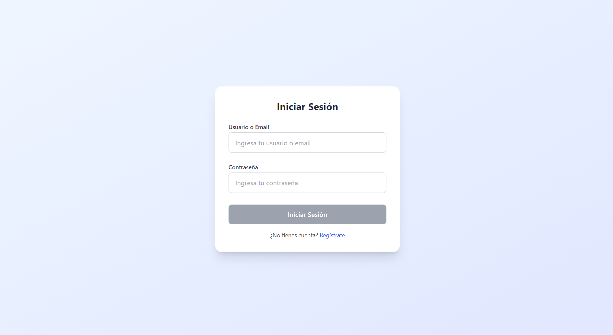

### Registro de estudiante
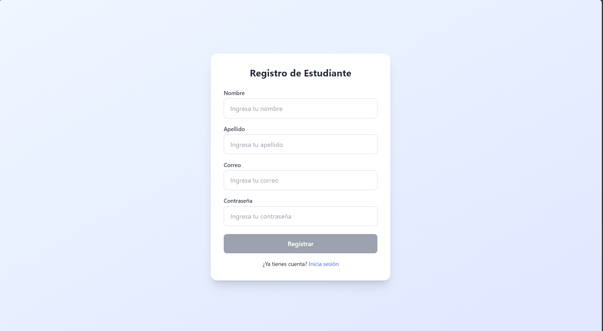

### Registro de profesor
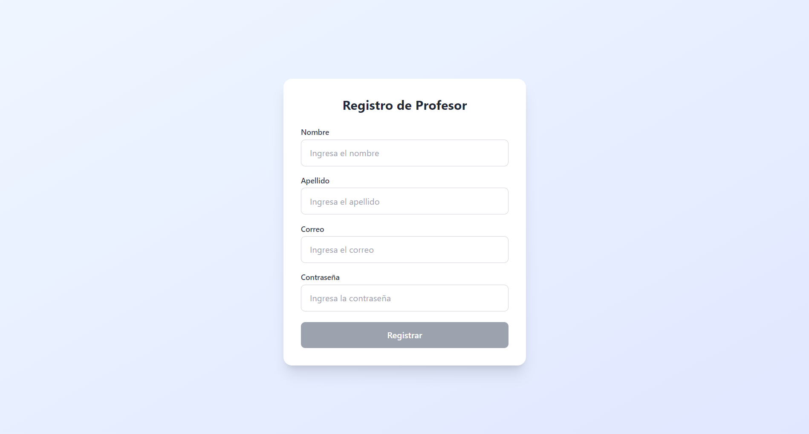

### Panel principal

---

## Sección de Estudiante

### Vista principal del estudiante en modo oscuro
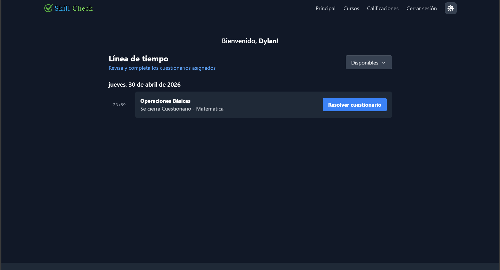

### Iniciar cuestionario
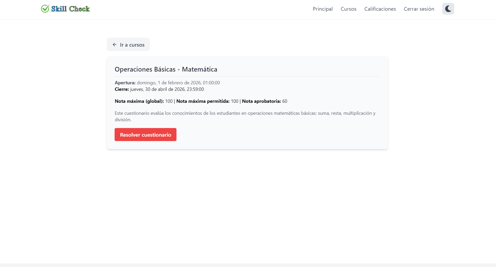

### Cuestionario
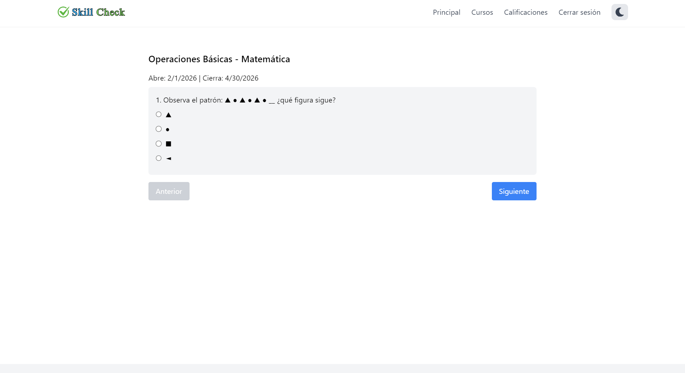

### Completar cuestionario

### Resultado del cuestionario

### Sección de cursos
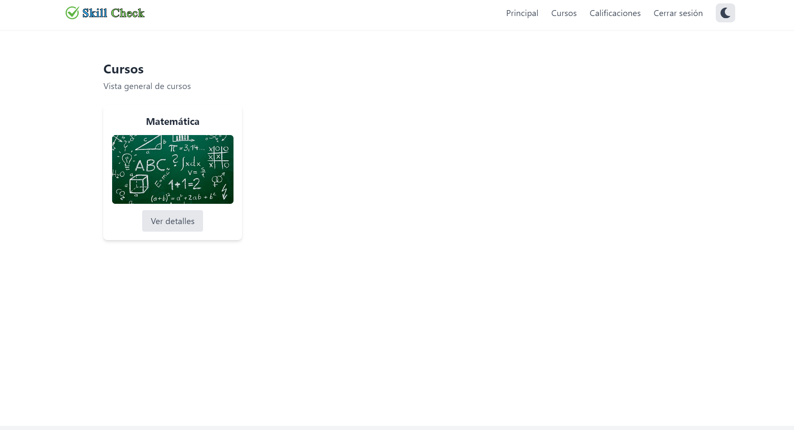

### Detalles del curso
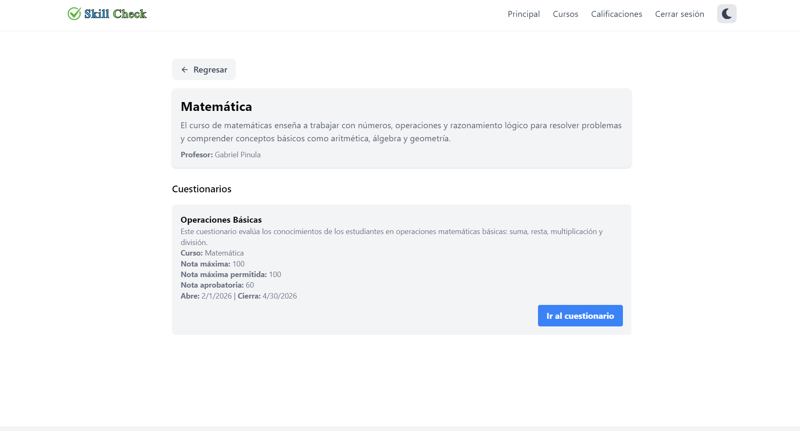

### Sección de calificaciones de los cursos
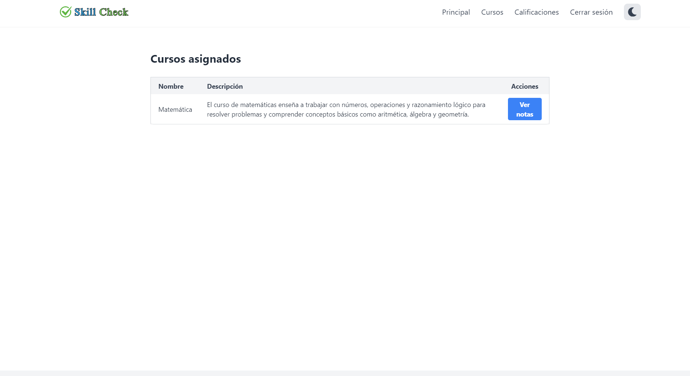

### Intento de cuestionario
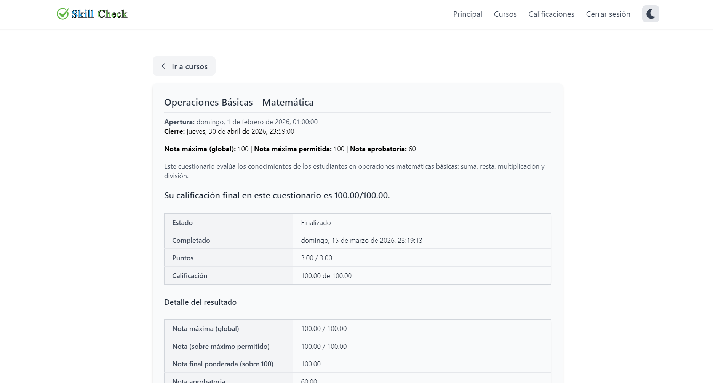

---

## Sección de Administrador y Profesor

### Vista principal del administrador/profesor
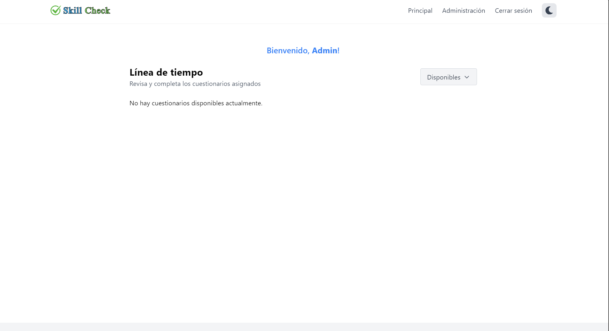

### Lista de cursos
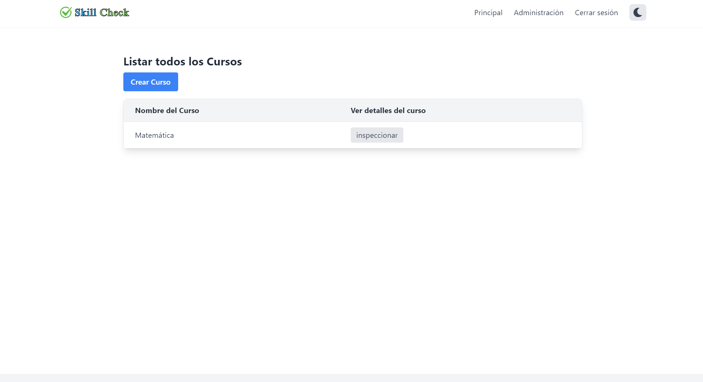

### Crear curso

### Crear curso en modo oscuro
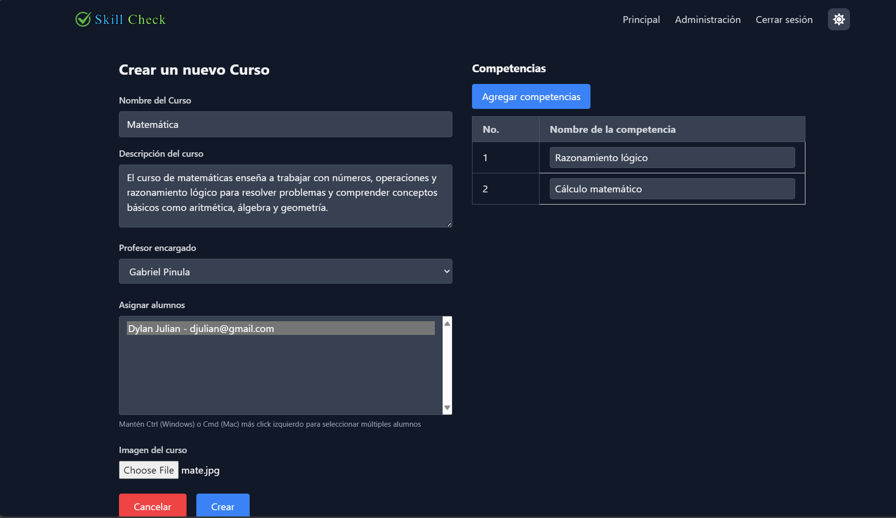

### Sección de cursos

### Detalles del curso
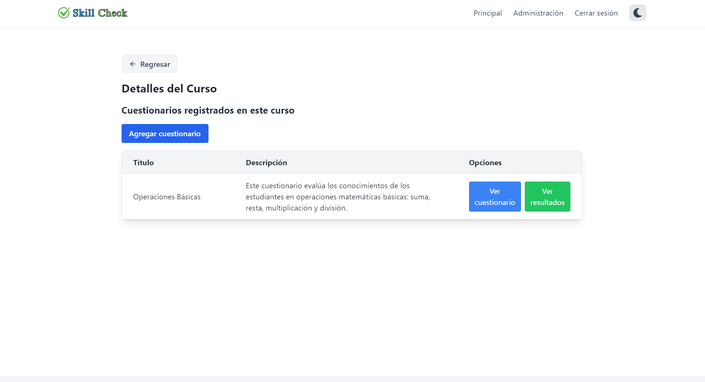

### Crear cuestionario

### Crear cuestionario (Paso 2)
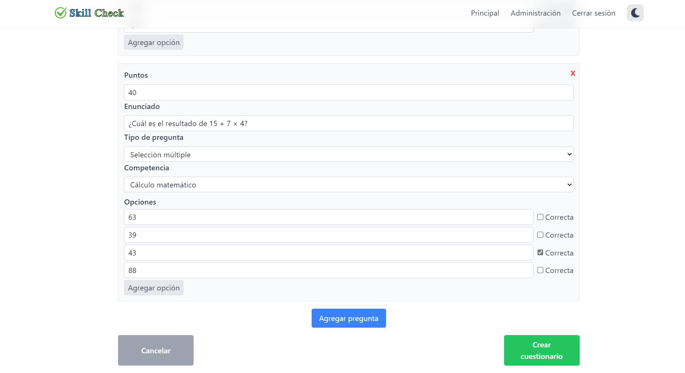

### Detalles del cuestionario
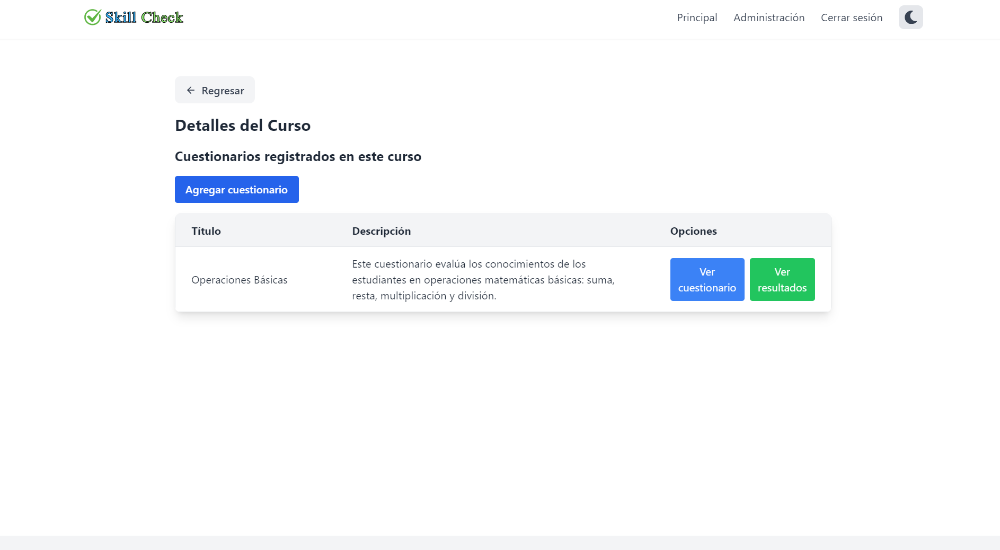

### Revisar cuestionario
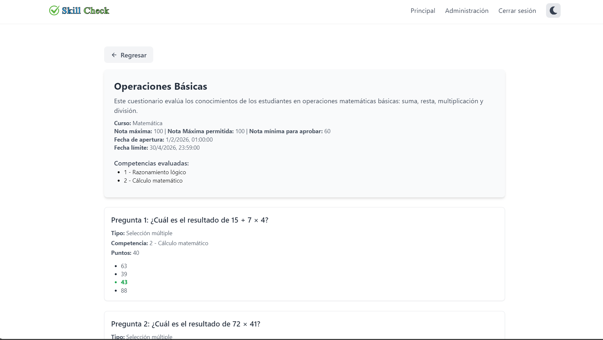

### Resultados del cuestionario
